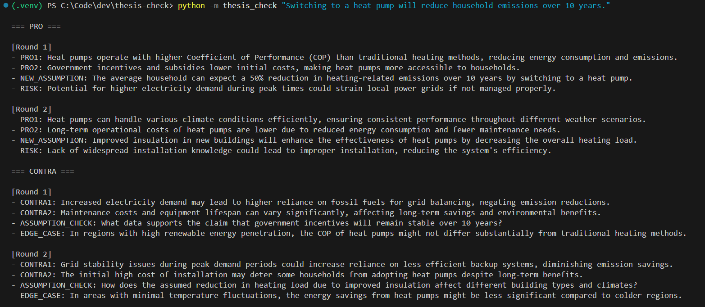
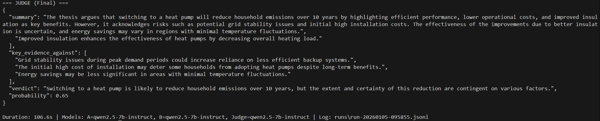

# ThesisCheck

**ThesisCheck** is a local multi-agent debate runner: two LLM agents argue **Pro** vs. **Contra** for a given thesis, and a neutral **Judge** model produces a structured decision summary as strict JSON.

It is designed for **local inference** via an **OpenAI-compatible API** (e.g., **LM Studio**), so you can run argumentation and evaluation **privacy-friendly** without external services.

---

## What it does

Given a thesis (e.g., “I will keep driving my Audi A4 (2018) until 2030”), ThesisCheck:

1. Runs **Agent A (Pro)** with a higher temperature (more creative).
2. Runs **Agent B (Contra)** with a lower temperature (more critical).
3. Runs a **Judge** model that:
   - summarizes the last round,
   - extracts key evidence “for” and “against”,
   - outputs a verdict and a conservative probability estimate (`0.0–1.0`),
   - returns **strict JSON** (no markdown, no commentary).

The debate runs for up to `MAX_ROUNDS` rounds and can stop early based on:
- **Stop phrases** (configurable),
- **Convergence** (judge probability changes only marginally between rounds).

## Demo

### Example run (PRO / CONTRA)


### Judge output (strict JSON)


---

## Why this project exists

This project demonstrates:
- **Agent orchestration** (role separation, temperatures, deterministic options)
- **Prompt discipline** with strict output templates per agent
- **Validation + retries** (template enforcement, anti-mirroring, anti-repeat)
- **Local model integration** via OpenAI-compatible endpoints
- **Structured logging** for later analysis/evaluation (JSONL)

---

## Requirements

- Python **3.11+** (works with newer versions as well)
- LM Studio (or any OpenAI-compatible local server) running a chat model

Python dependencies:
- `openai`
- `python-dotenv`
- (optional extras used in some setups: `tenacity`, `loguru`, `rich`)

---

## Setup

### 1) Create and activate a virtual environment (Windows PowerShell)

```powershell
python -m venv .venv
.\.venv\Scripts\Activate.ps1
python -m pip install --upgrade pip
pip install -r requirements.txt
```

### 2) Configure environment variables
Copy the example env file:
```powershell
copy .env.example .env
```

Typical .env:
```env
LOCAL_BASE_URL=http://127.0.0.1:1234/v1
LOCAL_API_KEY=lm-studio

MODEL_CREATIVE=qwen2.5-7b-instruct
MODEL_CRITICAL=qwen2.5-7b-instruct
MODEL_JUDGE=qwen2.5-7b-instruct

TEMP_A=0.8
TEMP_B=0.2
TEMP_J=0.0

MAX_ROUNDS=3
CONVERGENCE_DELTA=0.05
STOP_PHRASES=STOP_PHRASES=agreement reached;no new points

LOG_DIR=runs
MAX_CHARS_AGENT=700
MAX_CHARS_JUDGE=2500
SEED=
```
### 3) Start LM Studio Local Server
- In LM Studio, open Developer / Local Server
- Select a model and click Start Server
- Ensure the base URL matches your .env (commonly http://localhost:1234/v1)
Quick connectivity checks:
```powershell
Test-NetConnection 127.0.0.1 -Port 1234
curl http://127.0.0.1:1234/v1/models
```
## Run
```powershell
python -m thesis_check "I will keep driving my Audi A4 Quattro (2018) until 2030."
```
Output includes:
- PRO rounds
- CONTRA rounds
- Final Judge JSON
Logs are written to:
runs/run-YYYYMMDD-HHMMSS.jsonl

## Logging (JSONL)
Each run writes structured events to folder "runs" (one JSON object per line), e.g.:
- agentA / agentB events:
-- round number
-- raw agent text
- judge_probe events:
-- intermediate judge result per round (used for convergence checks)
- judge_final event:
-- final decision payload

This enables easy post-hoc analysis (e.g., scoring, comparing models, tracking regressions).

## Architecture
Roles
- Agent A (Pro): creative arguments, strict template
- Agent B (Contra): critical counter-arguments, strict template
- Judge: strict JSON, conservative probability
Key design points
- Strict templates: prevents drift and makes output machine-readable
- Validation + retries:
-- enforce template structure
-- avoid simple mirroring of the other agent
-- avoid repeating the agent’s own previous output
- Convergence stopping:
-- if judge probability changes less than CONVERGENCE_DELTA, stop early
- Local-first:
-- no cloud dependency required

## Customization
### Models
Swap models via .env:
```env
MODEL_CREATIVE=...
MODEL_CRITICAL=...
MODEL_JUDGE=...
```
### Temperatures
- TEMP_A: higher = more creative, more variety (but more format risk)
- TEMP_B: lower = more consistent, more critical
- TEMP_J: keep low (0.0–0.2) for stable JSON

### Debate length
- MAX_ROUNDS: 2–3 often gives best cost/benefit
- CONVERGENCE_DELTA: larger stops earlier (faster), smaller debates longer

### Output length
- MAX_CHARS_AGENT: keep short to reduce token cost and repetition
- MAX_CHARS_JUDGE: allow enough space to avoid JSON truncation

## Safety and reliability notes
- The system is designed to avoid unsafe instructions and avoid invented sources/statistics.
- For real-world claims (especially politics, finance, medical), treat results as structured reasoning, not ground truth.
- The judge is instructed to be conservative in probability estimates.

## Troubleshooting
### “Connection refused” / WinError 10061
LM Studio server is not running or wrong port/base URL.
- Start the local server in LM Studio
- Verify .env LOCAL_BASE_URL
- Test with curl http://127.0.0.1:1234/v1/models

JSON-Fallback from Judge
Judge output was not valid JSON.
- Lower TEMP_J (e.g., 0.0–0.1)
- Increase MAX_CHARS_JUDGE
- Ensure the code does not truncate before JSON parsing

### Agents repeat themselves
- Reduce rounds (MAX_ROUNDS=3)
- Keep templates short (MAX_CHARS_AGENT)
- Lower temperatures slightly

## Project structure
```arduino
thesis-check/
  thesis_check/
    __init__.py
    __main__.py
    cli.py
    config.py
    llm.py
    prompts.py
    validators.py
    runner.py
  runs/                 # logs (ignored by git)
  .env.example          # checked in
  .env                 # local only (ignored)
  .gitignore
  requirements.txt
  README.md
```
